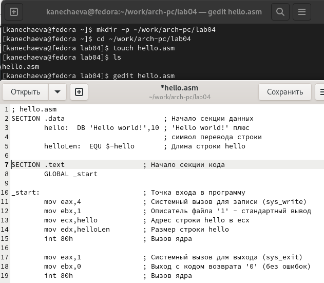
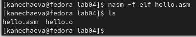
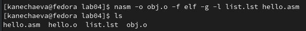
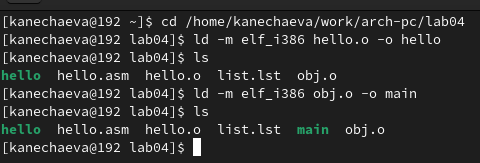
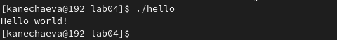
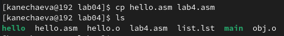
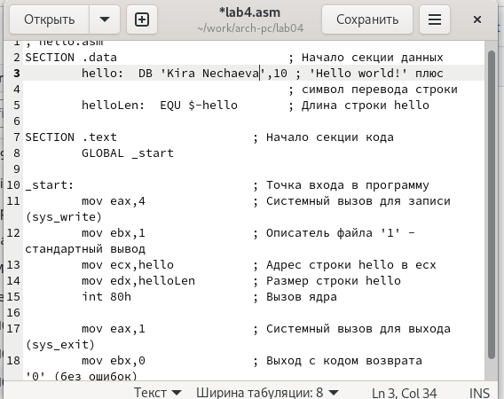
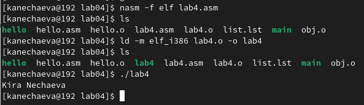
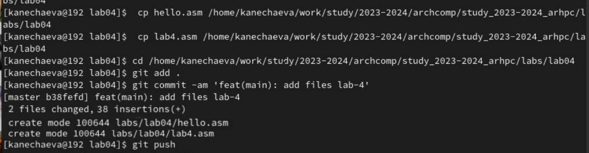

---
## Front matter
title: "Отчет по лабораторной работе № 4"
subtitle: "дисциплина:	Архитектура компьютера"
author: "Нечаева Кира"

## Generic otions
lang: ru-RU
toc-title: "Содержание"

## Bibliography
bibliography: bib/cite.bib
csl: pandoc/csl/gost-r-7-0-5-2008-numeric.csl

## Pdf output format
toc: true # Table of contents
toc-depth: 2
lof: true # List of figures
lot: true # List of tables
fontsize: 12pt
linestretch: 1.5
papersize: a4
documentclass: scrreprt
## I18n polyglossia
polyglossia-lang:
  name: russian
  options:
	- spelling=modern
	- babelshorthands=true
polyglossia-otherlangs:
  name: english
## I18n babel
babel-lang: russian
babel-otherlangs: english
## Fonts
mainfont: PT Serif
romanfont: PT Serif
sansfont: PT Sans
monofont: PT Mono
mainfontoptions: Ligatures=TeX
romanfontoptions: Ligatures=TeX
sansfontoptions: Ligatures=TeX,Scale=MatchLowercase
monofontoptions: Scale=MatchLowercase,Scale=0.9
## Biblatex
biblatex: true
biblio-style: "gost-numeric"
biblatexoptions:
  - parentracker=true
  - backend=biber
  - hyperref=auto
  - language=auto
  - autolang=other*
  - citestyle=gost-numeric
## Pandoc-crossref LaTeX customization
figureTitle: "Рис."
tableTitle: "Таблица"
listingTitle: "Листинг"
lofTitle: "Список иллюстраций"
lotTitle: "Список таблиц"
lolTitle: "Листинги"
## Misc options
indent: true
header-includes:
  - \usepackage{indentfirst}
  - \usepackage{float} # keep figures where there are in the text
  - \floatplacement{figure}{H} # keep figures where there are in the text
---

# 1 Цель работы
Целью работы является освоение процедуры компиляции и сборки программ, написанных на ассемблере NASM.

# 2 Задание
    1. Программа Hello world!
    2. Транслятор NASM
    3. Расширенный синтаксис командной строки NASM
    4. Компоновщик LD
    5. Запуск исполняемого файла
    6. Задание для самостоятельной работы

# 3 Выолнение лабораторной работы
## 1. Программа Hello world!
	Для начала создаю каталог для работы с программами на языке ассемблера NASM, используя команду mkdir и ключ -p. Перехожу в созданный каталог.  Затем создаю текстовый файл с именем hello.asm и проверяю правильность выполненных действий с использованием утилиты ls. Открываю файл с помощью текстового редактора gedit и ввожу текст, который можно увидеть на рис. [-@fig:001].
 
{#fig:001 width=70% } 

## 2. Транслятор NASM
Для компиляции приведённого выше текста программы «Hello World» необходимо написать: nasm -f elf hello.asm. Ключ -f указывает транслятору, что требуется создать бинарные файлы в формате ELF. 
С помощью команды ls проверяю, что объектный файл был создан. Он имеет название hello.o. Это означает, что текст программы был набран без ошибок и  транслятор преобразовал текст программы из файла hello.asm в объектный код, который записался в файл hello.o. (рис. [-@fig:002])

{#fig:002 width=70% } 

## *3. Расширенный синтаксис командной строки NASM*
Мне нужно выполнить команду: 
nasm -o obj.o -f elf -g -l list.lst hello.asm 
Эта команда компилирует исходный файл hello.asm в obj.o (ключ -o позволяет задать имя объектного файла, в данном случае obj.o), при этом формат выходного файла будет elf, и в него будут включены символы для отладки при помощи опции -g. Кроме того, будет создан файл list.lst (опция -l). 
Проверяю, что все файлы были созданы. (рис. [-@fig:003])

{#fig:003 width=70% } 

## *4. Компоновщик LD*
Передаю объектный файл на обработку компоновщику, чтобы получить исполняемую программу.
С помощью команды ls проверяю, что исполняемый файл hello был создан. Ключ -o задаёт в данном случае имя создаваемого исполняемого файла. 
Далее выполняю команду ld -m elf_i386 obj.o -o main. Исполняемый файл будет иметь имя main, т.к. после ключа -о было задано значение main. Объектный файл, из которого собран этот исполняемый файл, имеет имя obj.o. (рис. [-@fig:004])

{#fig:004 width=70% } 

## *5. Запуск исполняемого файла*
Запускаю исполняемый файл hello. (рис. [-@fig:005])

{#fig:005 width=70% } 

## *6. Задание для самостоятельной работы*
1. В каталоге ~/work/arch-pc/lab04 с помощью команды cp создаю копию файла hello.asm с именем lab4.asm. (рис. [-@fig:006])

{#fig:006 width=70% } 

2. С помощью текстового редактора gedit вношу изменения в текст программы так, чтобы вместо Hello world! на экран выводилась строка с моими фамилией и именем. (рис. [-@fig:007])

{#fig:007 width=70% } 

3. Транслирую полученный текст программы lab4.asm в объектный файл. Выполняю компоновку объектного файла и запускаю получившийся исполняемый файл. (рис. [-@fig:008])

{#fig:008 width=70% } 

4. Копирую файлы hello.asm и lab4.asm в Ваш локальный репозиторий в каталог ~/work/study/2023-2024/"Архитектура компьютера"/arch-pc/labs/lab04/. Загружаю файлы на Github. (рис. [-@fig:009])

{#fig:009 width=70% } 

# *4 Вывод*
При выполнении данной лабораторной работы я освоила процедуры компиляции и сборки программ, написанных на ассемблере NASM.

# *5 Источники*
1. ТУИС – Архитектура ЭВМ – [Электронный ресурс] -
https://esystem.rudn.ru/mod/resource/view.php?id=1030552
