---
## Front matter
title: "Отчет по лабораторной работе № 6"
subtitle: "дисциплина:	Архитектура компьютера"
author: "Нечаева Кира"

## Generic otions
lang: ru-RU
toc-title: "Содержание"

## Bibliography
bibliography: bib/cite.bib
csl: pandoc/csl/gost-r-7-0-5-2008-numeric.csl

## Pdf output format
toc: true # Table of contents
toc-depth: 2
lof: true # List of figures
lot: true # List of tables
fontsize: 12pt
linestretch: 1.5
papersize: a4
documentclass: scrreprt
## I18n polyglossia
polyglossia-lang:
  name: russian
  options:
	- spelling=modern
	- babelshorthands=true
polyglossia-otherlangs:
  name: english
## I18n babel
babel-lang: russian
babel-otherlangs: english
## Fonts
mainfont: PT Serif
romanfont: PT Serif
sansfont: PT Sans
monofont: PT Mono
mainfontoptions: Ligatures=TeX
romanfontoptions: Ligatures=TeX
sansfontoptions: Ligatures=TeX,Scale=MatchLowercase
monofontoptions: Scale=MatchLowercase,Scale=0.9
## Biblatex
biblatex: true
biblio-style: "gost-numeric"
biblatexoptions:
  - parentracker=true
  - backend=biber
  - hyperref=auto
  - language=auto
  - autolang=other*
  - citestyle=gost-numeric
## Pandoc-crossref LaTeX customization
figureTitle: "Рис."
tableTitle: "Таблица"
listingTitle: "Листинг"
lofTitle: "Список иллюстраций"
lotTitle: "Список таблиц"
lolTitle: "Листинги"
## Misc options
indent: true
header-includes:
  - \usepackage{indentfirst}
  - \usepackage{float} # keep figures where there are in the text
  - \floatplacement{figure}{H} # keep figures where there are in the text
---

# *1 Цель работы*
Целью работы является oсвоение арифметических инструкций языка ассемблера NASM.

# *2 Задание*
    1. Символьные и численные данные в NASM
    2. Выполнение арифметических операций в NASM
    3. Ответы на вопросы
    4. Задание для самостоятельной работы

# *3 Выолнение лабораторной работы*
## *1. Символьные и численные данные в NASM*
	
Для начала я создаю каталог для программам лабораторной работы № 6, перехожу в него и создаю файл lab6-1.asm. (рис. [-@fig:001])
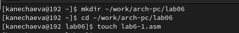{#fig:001 width=70% }

Затем открываю Midnight Commander в терминале и с помощью функциональной клавиши F4  открываю файл lab6-1.asm для редактирования во встроенном редакторе. Затем ввожу текст программы из листинга 6.1, после чего сохраняю изменения и закрываю файл. (рис. [-@fig:002])
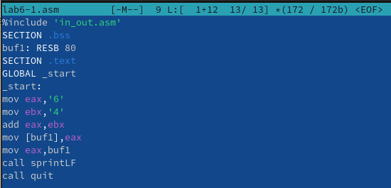{#fig:002 width=70% }

После копирования файла in_out.asm из файла lab05 в файл lab06 запускаю файл. (рис. [-@fig:003])
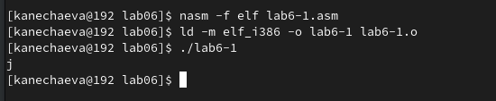{#fig:003 width=70% }

Далее изменяю текст программы. Вместо символов, записываю числа в регистры. (рис. [-@fig:004])
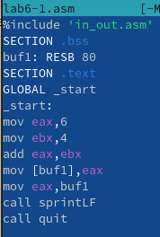{#fig:004 width=70% }

Теперь создаю исполняемый файл и запускаю его. (рис. [-@fig:005])
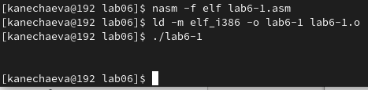{#fig:005 width=70% }

Теперь вывелся символ с кодом 10. В соответствии с ASCII таблицой это символ перевода строк и он не отображается при выводе на экран.
Теперь создаю файл lab6-2.asm в каталоге ~/work/arch-pc/lab06. (рис. [-@fig:006])
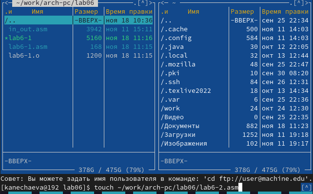{#fig:006 width=70% }

После этого ввожу в него текст программы из листинга 6.2, затем создаю исполняемый файл и запускаю его. (рис. [-@fig:007])
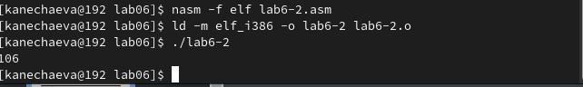{#fig:007 width=70% }

Аналогично предыдущему примеру изменяю символы на числа. Запускаю файл. (рис. [-@fig:008])
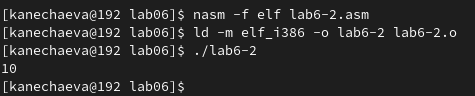{#fig:008 width=70% }
Теперь при исполнении программы будет получен не соответствующий символам код в системе ASCII, а само число, то есть 10.
Далее заменяю функцию iprintLF на iprint. Создаю исполняемый файл и запускаю его. (рис. [-@fig:009]) 
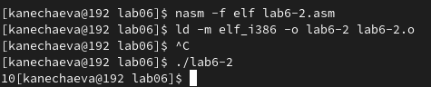{#fig:009 width=70% }
Изменилось то, что исчез символьный перенос строк, который был засчет ограничения LF для iprint.

## *2. Выполнение арифметических операций в NASM*

Создаю файл lab6-3.asm в каталоге ~/work/arch-pc/lab06 и ввожу в файл текст программы из листинга 6.3. Создаю исполняемый файл и запускаю его. 
(рис. [-@fig:010])
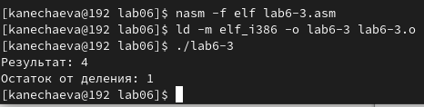{#fig:010 width=70% }

Затем изменяю текст программы для вычисления выражения 𝑓(𝑥) = (4 ∗ 6 + 2)/5. (рис. [-@fig:011])
{#fig:011 width=70% }
Создаю исполняемый файл и проверяю его работу. (рис. [-@fig:012]) 
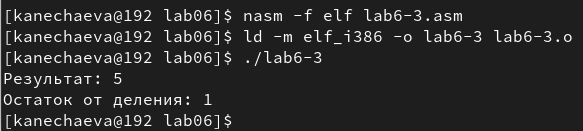{#fig:012 width=70% }

В качестве другого примера рассмотрю программу вычисления варианта задания по номеру студенческого билета, работающую по следующему алгоритму: 
• вывести запрос на введение № студенческого билета 
• вычислить номер варианта по формуле: (𝑆𝑛 mod 20) + 1, где 𝑆𝑛 – номер студенческого билета (В данном случае 𝑎 mod 𝑏 – это остаток от деления 𝑎 на 𝑏). 
• вывести на экран номер варианта.
Для этого создаю файл variant.asm в каталоге и ввожу в него текст программы из листинга 6.4. (рис. [-@fig:013])
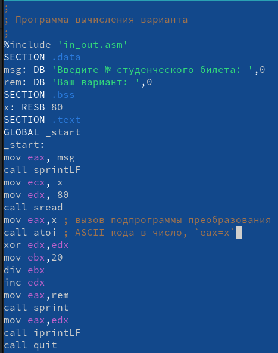{#fig:013 width=70% }
Создаю исполняемый файл и запускаю его. Программа вывела, что мой вариант - 12. (рис. [-@fig:014])
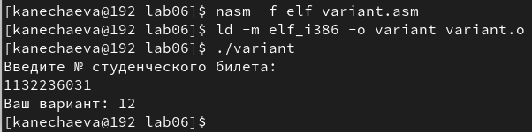{#fig:014 width=70% }

## *3. Ответы на вопросы*
1. Для вывода сообщения «Ваш вариант» предоставляются строки кода:
mov eax,rem
call sprint
2. Инструкция mov ecx, x используется, чтобы поставить адрес вводимой строки x в регистр ecx mov edx, 80 - запись в регистр edx длины вводимой строки call sread - вызов подпрограммы из внешнего файла, вводы сообщений с клавиатуры
3. Вызов atoi используется для вызова подпрограмм из внешнего файла, который преобразует символы ascii-кода в имена чисел и записывает результат в регистр eax.
4. Для обработки решений предоставляются следующие предложения:
xor edx,edx ; обнуление edx для корректной работы div
mov ebx,20 ; ebx = 20
div ebx ; eax = eax/20, edx - остаток от деления
inc edx ; edx = edx + 1
5. При выполнении инструкции остаток деления div ebx записывается в регистр edx.
6. Инструкция inc edx увеличивает значение регистра edx на 1
7. Для вывода результатов на экране компьютерных представлений:
mov eax,edx
call iprintLF

## *4.  Задание для самостоятельной работы*

Создаю файл lab6-4.asm и ввожу в него текст программы для вычисления значений выражений (8𝑥 − 6)/2. Это выражение было в варианте 12. (рис. [-@fig:015])
{#fig:015 width=70% }
Зпускаю файл. (рис. [-@fig:016])
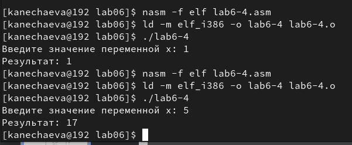{#fig:016 width=70% }
# *4 Вывод*
При выполнении данной лабораторной работы я освоила арифметическиe инструкции языка ассемблера NASM.
# *5 Источники*
1. ТУИС – Архитектура ЭВМ – [Электронный ресурс] -
https://esystem.rudn.ru/mod/resource/view.php?id=1030554

