---
## Front matter
title: "Отчет по лабораторной работе № 6"
subtitle: "дисциплина:	Архитектура компьютера"
author: "Нечаева Кира"

## Generic otions
lang: ru-RU
toc-title: "Содержание"

## Bibliography
bibliography: bib/cite.bib
csl: pandoc/csl/gost-r-7-0-5-2008-numeric.csl

## Pdf output format
toc: true # Table of contents
toc-depth: 2
lof: true # List of figures
lot: true # List of tables
fontsize: 12pt
linestretch: 1.5
papersize: a4
documentclass: scrreprt
## I18n polyglossia
polyglossia-lang:
  name: russian
  options:
	- spelling=modern
	- babelshorthands=true
polyglossia-otherlangs:
  name: english
## I18n babel
babel-lang: russian
babel-otherlangs: english
## Fonts
mainfont: PT Serif
romanfont: PT Serif
sansfont: PT Sans
monofont: PT Mono
mainfontoptions: Ligatures=TeX
romanfontoptions: Ligatures=TeX
sansfontoptions: Ligatures=TeX,Scale=MatchLowercase
monofontoptions: Scale=MatchLowercase,Scale=0.9
## Biblatex
biblatex: true
biblio-style: "gost-numeric"
biblatexoptions:
  - parentracker=true
  - backend=biber
  - hyperref=auto
  - language=auto
  - autolang=other*
  - citestyle=gost-numeric
## Pandoc-crossref LaTeX customization
figureTitle: "Рис."
tableTitle: "Таблица"
listingTitle: "Листинг"
lofTitle: "Список иллюстраций"
lotTitle: "Список таблиц"
lolTitle: "Листинги"
## Misc options
indent: true
header-includes:
  - \usepackage{indentfirst}
  - \usepackage{float} # keep figures where there are in the text
  - \floatplacement{figure}{H} # keep figures where there are in the text
---

# *1 Цель работы*
Целью работы является изучение команд условного и безусловного переходов, приобретение навыков написания программ с использованием переходов, а также знакомство с назначением и структурой файла листинга.

# *2 Задание*
    1. Реализация переходов в NASM
    2. Изучение структуры файла листинга
    3. Задание для самостоятельной работы

# *3 Выолнение лабораторной работы*
## *1.  Реализация переходов в NASM*
	
Для начала я создаю каталог для программ лабораторной работы № 7, перехожу в него и создаю файл lab7-1.asm. (рис. [-@fig:001])
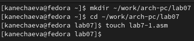{#fig:001 width=70% }
В качестве примера программы с использованием инструкции jmp воспользуюсь текстом программы из листинга 7.1. Для этого я введу его в файл lab7-1.asm, скопировав зарание файл in_out.asm в папку (рис. [-@fig:002])
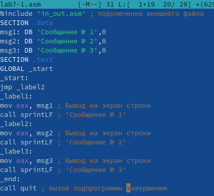{#fig:002 width=70% } 

Создаю исполняемый файл и запускаю его. (рис. [-@fig:003])
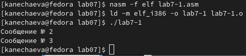{#fig:003 width=70% }
Теперь я изменю программу таким образом, чтобы она выводила сначала ‘Сообщение № 2’, потом ‘Сообщение № 1’ и завершала работу. Для этого изменяю текст программы в соответствии с листингом 7.2. ((рис. [-@fig:004])
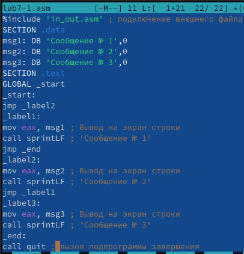{#fig:004 width=70% }
Создаю исполняемый файл и запускаю его. (рис. [-@fig:005])
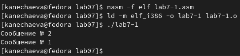{#fig:005 width=70% }
Теперь мне нужно изменить текст программы таким образом, чтобы сначала выводилось “Сообщение №3”, затем “Сообщение №2” и в конце “Сообщение №1”. ((рис. [-@fig:006])
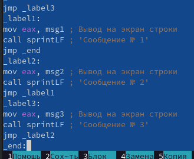{#fig:006 width=70% }
Создаю исполняемый файл и запускаю его. (рис. [-@fig:007])
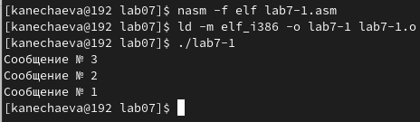{#fig:007 width=70% }

Создаю файл lab7-2.asm в каталоге ~/work/arch-pc/lab07 и ввожу в него текст программы из листинга 7.3. (рис. [-@fig:008])
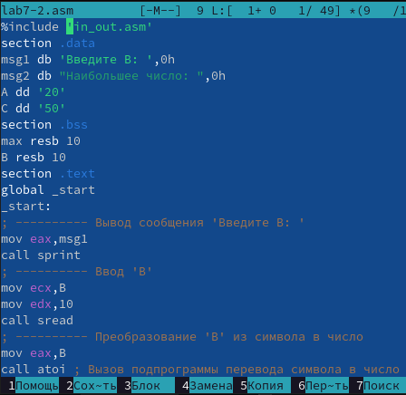{#fig:008 width=70% } 
Создаю исполняемый файл и проверяю его работу для разных значений B. 
(рис. [-@fig:009]) 
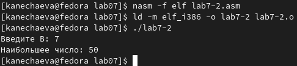{#fig:009 width=70% }

## *2. Изучение структуры файла листинга*

Создаю файл листинга для программы из файла lab7-2.asm. (рис. [-@fig:010])
{#fig:010 width=70% }
Открываю файл листинга lab7-2.lst с помощью текстового редактора mcedit.(рис. [-@fig:011])
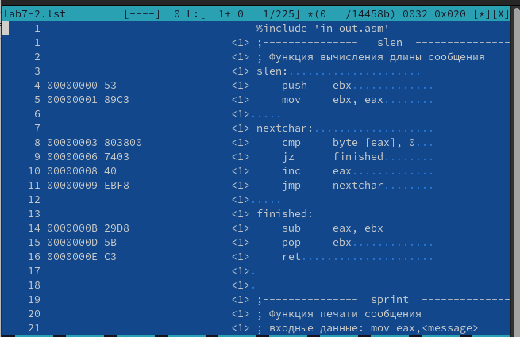{#fig:011 width=70% }
Oбъясняю содержимое трёх строк файла листинга:
35 call atoi - вызов подпрограммы перевода символа в число;
36 mov [max],eax - запись преобразованного числа в `max`;
39 cmp ecx,[B] - сравнение 'max(A,C)' и 'B'.
Открываю файл с программой lab7-2.asm и в инструкции с двумя операндами удаляю один операнд. (рис. [-@fig:012])
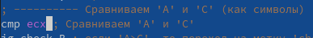{#fig:012 width=70% }
Выполняю трансляцию с получением файла листинга. [-@fig:013])
{#fig:013 width=70% }
Выходных файлов я не получаю. Программа выдаёт ошибку, т.к. в данной операции должны присутствовать два операнда, а не один.

## *3.  Задание для самостоятельной работы*

№1
Требуется написать программу нахождения наименьшей из 3 целочисленных переменных 𝑎,𝑏 и с. При выполнении лабораторной работы №6 я получила 12 вариант. Значит, в соответствии с таблицей 7.5, значения моих переменных – 99,29,26. 
Создаю файл lab7-3.asm и пишу в нём программу. ([-@fig:014])
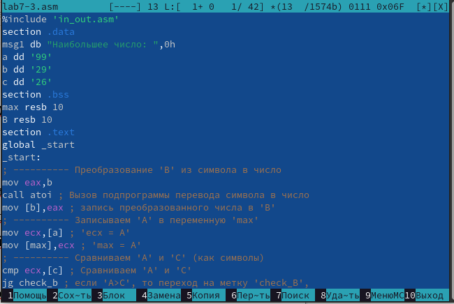{#fig:014 width=70% }
Создаю исполняемый файл и проверяю его работу. (рис. [-@fig:015])
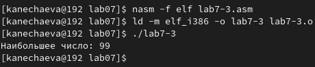{#fig:015 width=70% }

№2
Теперь мне нужно написать программу, которая для введенных с клавиатуры значений 𝑥 и 𝑎 вычисляет значение заданной функции 𝑓(𝑥) и выводит результат вычислений. Вид моей функции 𝑓(𝑥): 
𝑎𝑥, 𝑥 < 5
𝑥 − 5, 𝑥 ≥ 5 
Создаю файл lab7-4.asm и пишу в нём программу. ([-@fig:016])
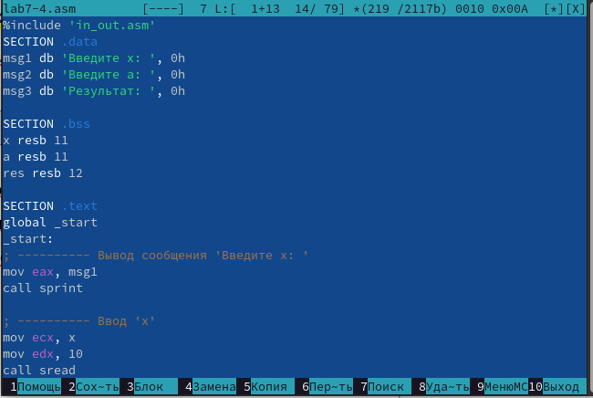{#fig:016 width=70% }
Создаю исполняемый файл и проверяю его работу сначала для x1=3, a1= 7, а затем для  x2=6, a2= 4. (рис. [-@fig:017])
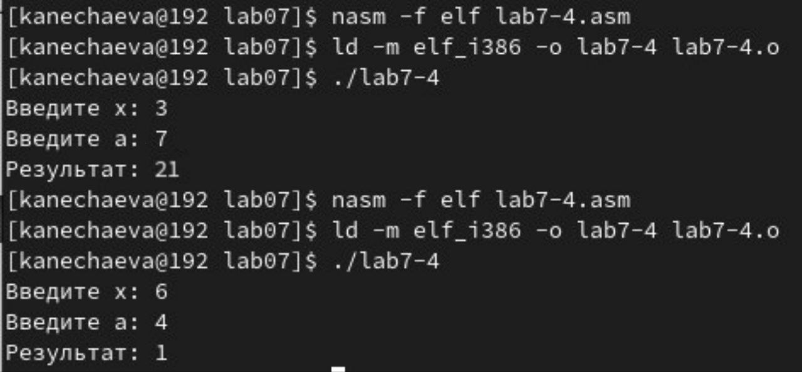{#fig:017 width=70% }

# *4 Вывод*
При выполнении данной лабораторной работы я изучила команды условного и безусловного переходов, приобрела навыки написания программ с использованием переходов, а также ознакомилась с назначением и структурой файла листинга.

# *5 Источники*
1. ТУИС – Архитектура ЭВМ – [Электронный ресурс] -
https://esystem.rudn.ru/mod/resource/view.php?id=1030556

