---
## Front matter
title: "Шаблон отчёта по лабораторной работе"
subtitle: "Простейший вариант"
author: "Дмитрий Сергеевич Кулябов"

## Generic otions
lang: ru-RU
toc-title: "Содержание"

## Bibliography
bibliography: bib/cite.bib
csl: pandoc/csl/gost-r-7-0-5-2008-numeric.csl

## Pdf output format
toc: true # Table of contents
toc-depth: 2
lof: true # List of figures
lot: true # List of tables
fontsize: 12pt
linestretch: 1.5
papersize: a4
documentclass: scrreprt
## I18n polyglossia
polyglossia-lang:
  name: russian
  options:
	- spelling=modern
	- babelshorthands=true
polyglossia-otherlangs:
  name: english
## I18n babel
babel-lang: russian
babel-otherlangs: english
## Fonts
mainfont: PT Serif
romanfont: PT Serif
sansfont: PT Sans
monofont: PT Mono
mainfontoptions: Ligatures=TeX
romanfontoptions: Ligatures=TeX
sansfontoptions: Ligatures=TeX,Scale=MatchLowercase
monofontoptions: Scale=MatchLowercase,Scale=0.9
## Biblatex
biblatex: true
biblio-style: "gost-numeric"
biblatexoptions:
  - parentracker=true
  - backend=biber
  - hyperref=auto
  - language=auto
  - autolang=other*
  - citestyle=gost-numeric
## Pandoc-crossref LaTeX customization
figureTitle: "Рис."
tableTitle: "Таблица"
listingTitle: "Листинг"
lofTitle: "Список иллюстраций"
lotTitle: "Список таблиц"
lolTitle: "Листинги"
## Misc options
indent: true
header-includes:
  - \usepackage{indentfirst}
  - \usepackage{float} # keep figures where there are in the text
  - \floatplacement{figure}{H} # keep figures where there are in the text
---

# *1 Цель работы*
Целью работы является приобретение навыков написания программ с использованием подпрограмм и ознакомление с методами отладки при помощи GDB и его основными возможностями.

# *2 Задание*
    1. Реализация подпрограмм в NASM
    2. Отладка программ с помощью GDB
        2.1. Добавление точек останова
        2.2. Работа с данными программы в GDB
        2.3. Обработка аргументов командной строки в GDB
    3. Задание для самостоятельной работы

# *3 Выолнение лабораторной работы*
## *1.  Реализация подпрограмм в NASM*

	
Для начала я создаю каталог для программ лабораторной работы № 9, перехожу в него и создаю файл lab09-1.asm. (рис. [-@fig:001])
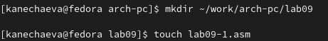{#fig:001 width=70% }

Ввожу в файл lab09-1.asm текст программы из листинга 9.1, скопировав заранее файл in_out.asm в папку lab09. (рис. [-@fig:002])
{#fig:002 width=70% } 

Создаю исполняемый файл и проверяю его работу. (рис. [-@fig:003])
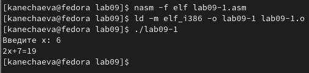{#fig:003 width=70% }

Теперь изменяю текст программы, добавив добавив подпрограмму _subcalcul в подпрограмму _calcul, для вычисления выражения f(g(x)). ((рис. [-@fig:004])
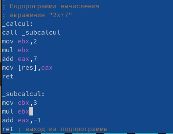{#fig:004 width=70% }

Создаю исполняемый файл и проверяю его работу. (рис. [-@fig:005])
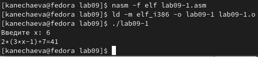{#fig:005 width=70% }

## *2. Отладка программ с помощью GDB*

Создаю файл lab09-2.asm в каталоге ~/work/arch-pc/lab09 и ввожу в него текст программы из листинга 9.2. ((рис. [-@fig:006])
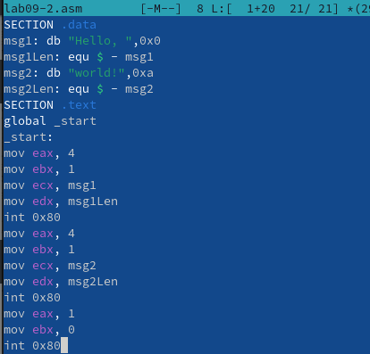{#fig:006 width=70% }

Проверяю работу программы, запустив ее в оболочке GDB с помощью команды run. (рис. [-@fig:007])
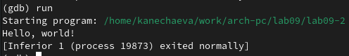{#fig:007 width=70% }

Для более подробного анализа программы устанавливаю брейкпоинт на метку _start, с которой начинается выполнение любой ассемблерной программы, и запускаю её. 
Затем смотрю дисассимилированный код программы с помощью команды disassemble начиная с метки _start. Переключаюсь на отображение команд с Intel’овским синтаксисом, введя команду set disassembly-flavor intel. (рис. [-@fig:008])
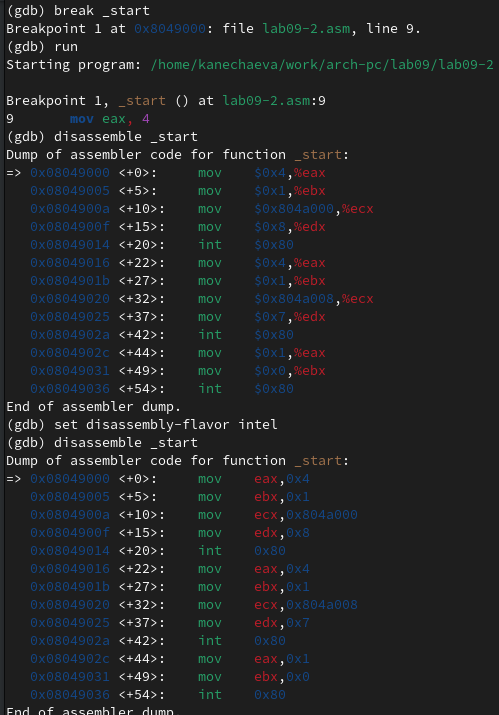{#fig:008 width=70% } 

Включаю режим псевдографики для более удобного анализа программы. 
(рис. [-@fig:009])
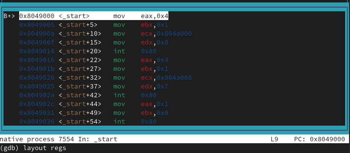{#fig:009 width=70% }

### *2. 1. Добавление точек останова*

На предыдущих шагах была установлена точка останова по имени метки (_start). Проверяю это с помощью команды info breakpoints. 
(рис. [-@fig:010])
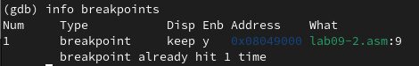{#fig:010 width=70% }

Определяю адрес предпоследней инструкции (mov ebx,0x0) и устанавливаю точку останова.(рис. [-@fig:011])
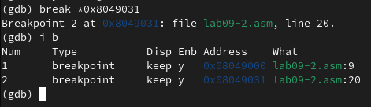{#fig:011 width=70% }

### *2. 2. Работа с данными программы в GDB*

Выполняю 5 инструкций с помощью команды stepi (или si). 
(рис. [-@fig:012])
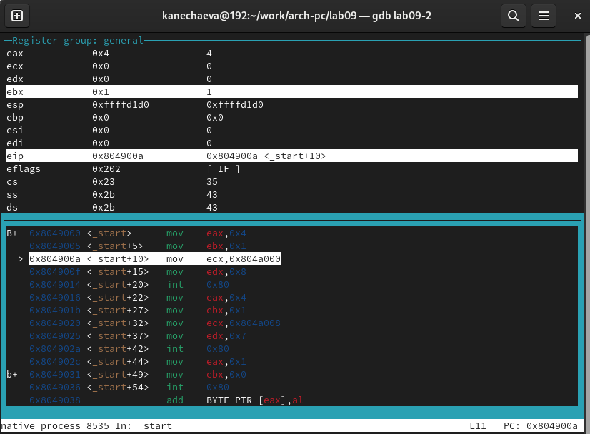{#fig:012 width=70% }
Изуменяются значения регистров eax, ebx, ecx, edx. 

Смотрю содержимое регистров с помощью команды info registers. (рис. [-@fig:013])
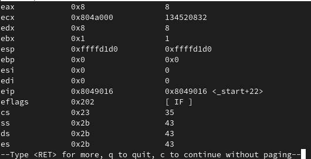{#fig:013 width=70% }

Теперь мне нужно значение переменной msg1 по имени.([-@fig:014])
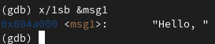{#fig:014 width=70% }

Затем я смотрю значение переменной msg2 по адресу. (рис. [-@fig:015])
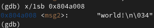{#fig:015 width=70% }

Изменяю первый символ переменной msg1. (рис. [-@fig:016])
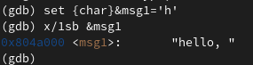{#fig:016 width=70% }

Заменяю третий символ во второй переменной msg2. (рис. [-@fig:017])
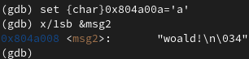{#fig:017 width=70% }

Вывожу в различных форматах (в шестнадцатеричном формате, в двоичном формате и в символьном виде) значение регистра edx. (рис. [-@fig:018])
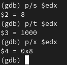{#fig:018 width=70% }

С помощью команды set изменяю значение регистра ebx. (рис. [-@fig:019])
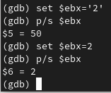{#fig:019 width=70% }
Разница вывода команд p/s $ebx в том, что в первый раз программа выдает 50, т.к. это значение символа 2, а во второй раз уже сам символ 2.

Завершаю выполнение программы с помощью команды continue (сокращенно c) и выхожу из GDB с помощью команды quit. (рис. [-@fig:020])
{#fig:020 width=70% }

### *2. 3. Обработка аргументов командной строки в GDB*

Копирую файл lab8-2.asm, созданный при выполнении лабораторной работы №8 с программой, выводящей на экран аргументы командной строки, в файл с именем lab09-3.asm. После этого создаю исполняемый файл и для загрузки в gdb программы с аргументами использую ключ –args. Теперь загружаю исполняемый файл в отладчик, указав определенные аргументы. (рис. [-@fig:021])
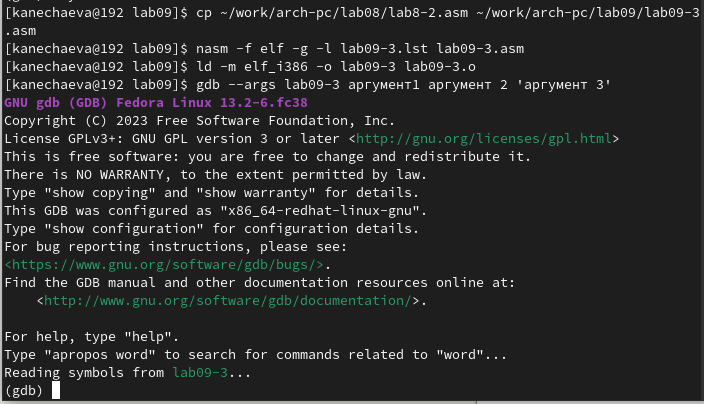{#fig:021 width=70% } 

Как отмечалось в предыдущей лабораторной работе, при запуске программы аргументы командной строки загружаются в стек. Исследуем расположение аргументов командной строки в стеке после запуска программы с помощью gdb.
Теперь устанавливаю точку останова перед первой инструкцией в программе и запускаю ее. (рис. [-@fig:022])
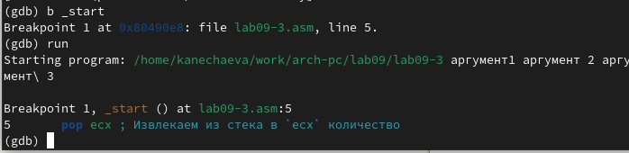{#fig:022 width=70% }

Адрес вершины стека хранится в регистре esp и по адресу вершины стека я смотрю количество аргументов командной строки (включая имя программы).(рис. [-@fig:023])
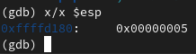{#fig:023 width=70% }

Как видно, число аргументов равно 5 – это имя программы lab09-3 и аргументы: аргумент1, аргумент, 2 и 'аргумент 3'.
Теперь я смотрю остальные позиции стека: [esp+4] – адрес с именем программы, [esp+8] - адрес первого аргумента, [esp+12] – второго и т.д. (рис. [-@fig:024])
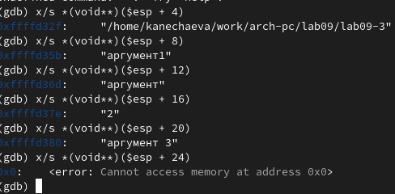{#fig:024 width=70% }

Шаг изменения адреса равен 4, т.к. размер ячейки памяти со значением, на которую указывает esp увеличивается на 4.

## *3.  Задание для самостоятельной работы*

1. Требуется преобразовать программу из задания для самостоятельной работы лабораторной работы №8, реализовав вычисление значения функции 𝑓(𝑥) как подпрограмму. Для начала копирую файл lab8-5.asm в lab09 с именем lab9-4.asm и уже там начинаю работу над кодом. (рис. [-@fig:025])
{#fig:025 width=70% }

Создаю исполнительный файл и запускаю его. [-@fig:026])
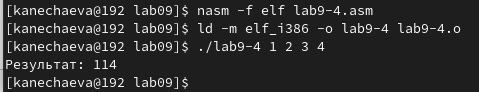{#fig:026 width=70% }

2. В листинге 9.3 приведена программа вычисления выражения (3 + 2) ∗ 4 + 5. При запуске данная программа дает неверный результат. [-@fig:027])
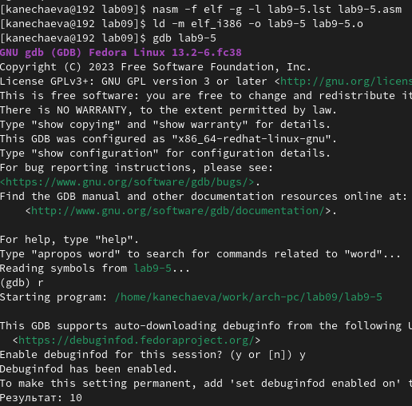{#fig:027 width=70% }

Включаю режим псевдографики для более удобного анализа программы. [-@fig:028])
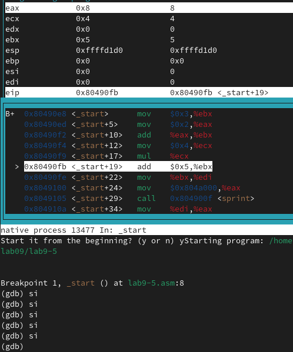{#fig:028 width=70% }

Сначала в еbх записывается 3, в еах записывается 2, потом они складываются и в переменной ebx, в есх записывается 4. После этого идет mul ecx и регистр eax становится 8. Это произошло, т.к. по умолчанию идет умножение на то что записано в eax, а там 2, а 2*4=8. Следовательно, надо записать результат сложения в переменную еах. И во всех дальнейших арифметических действиях я также заменяю edx на еах. [-@fig:029])
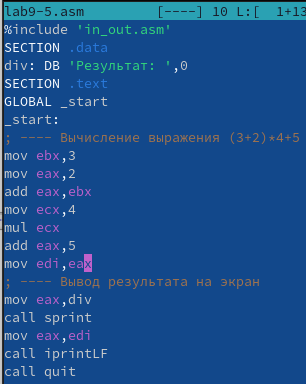{#fig:029 width=70% }

Исправляю программу и запускаю ее снова. [-@fig:030])
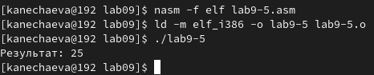{#fig:030 width=70% }

# *4 Вывод*

При выполнении данной лабораторной работы я приобрела навыки написания программ с использованием подпрограмм и ознакомилась с методами отладки при помощи GDB и его основными возможностями.

# *5 Источники*

1. ТУИС – Архитектура ЭВМ – [Электронный ресурс] -
https://esystem.rudn.ru/mod/resource/view.php?id=1030557
