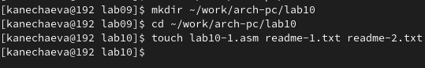
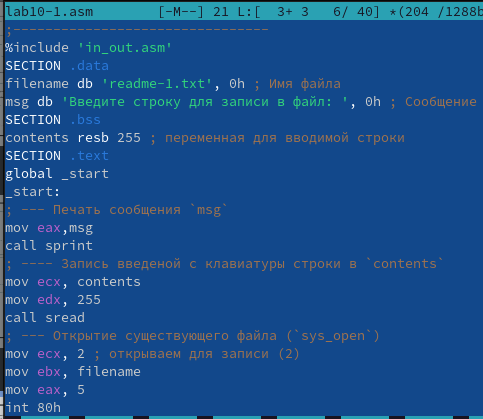
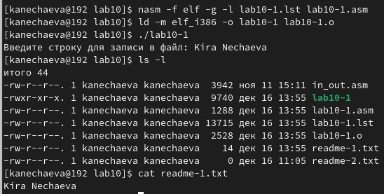
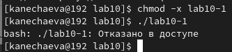
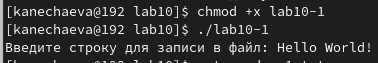
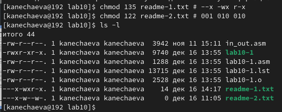
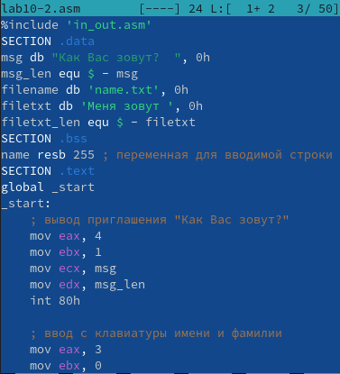
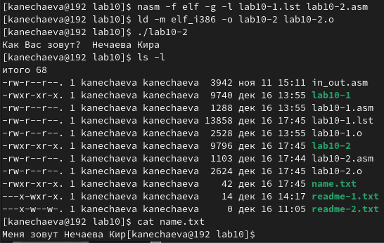

---
## Front matter
title: "Отчет по лабораторной работе № 10"
subtitle: "дисциплина:	Архитектура компьютера"
author: "Нечаева Кира"

## Generic otions
lang: ru-RU
toc-title: "Содержание"

## Bibliography
bibliography: bib/cite.bib
csl: pandoc/csl/gost-r-7-0-5-2008-numeric.csl

## Pdf output format
toc: true # Table of contents
toc-depth: 2
lof: true # List of figures
lot: true # List of tables
fontsize: 12pt
linestretch: 1.5
papersize: a4
documentclass: scrreprt
## I18n polyglossia
polyglossia-lang:
  name: russian
  options:
	- spelling=modern
	- babelshorthands=true
polyglossia-otherlangs:
  name: english
## I18n babel
babel-lang: russian
babel-otherlangs: english
## Fonts
mainfont: PT Serif
romanfont: PT Serif
sansfont: PT Sans
monofont: PT Mono
mainfontoptions: Ligatures=TeX
romanfontoptions: Ligatures=TeX
sansfontoptions: Ligatures=TeX,Scale=MatchLowercase
monofontoptions: Scale=MatchLowercase,Scale=0.9
## Biblatex
biblatex: true
biblio-style: "gost-numeric"
biblatexoptions:
  - parentracker=true
  - backend=biber
  - hyperref=auto
  - language=auto
  - autolang=other*
  - citestyle=gost-numeric
## Pandoc-crossref LaTeX customization
figureTitle: "Рис."
tableTitle: "Таблица"
listingTitle: "Листинг"
lofTitle: "Список иллюстраций"
lotTitle: "Список таблиц"
lolTitle: "Листинги"
## Misc options
indent: true
header-includes:
  - \usepackage{indentfirst}
  - \usepackage{float} # keep figures where there are in the text
  - \floatplacement{figure}{H} # keep figures where there are in the text
---

# *1 Цель работы*
Целью работы является приобретение навыков написания программ для работы с файлами.

# *2 Задание*
    1. Написание программ для работы с файлами
    2. Задание для самостоятельной работы

# *3 Выолнение лабораторной работы*
## *1. Написание программ для работы с файлами*

	
1. Создаю каталог для программам лабораторной работы № 10, перехожу в него и создаю файлы lab10-1.asm, readme-1.txt и readme-2.txt. (рис. [-@fig:001])
{#fig:001 width=70% }

2. Ввожу в файл lab10-1.asm текст программы из листинга 10.1, скопировав заранее файл in_out.asm в папку lab09. (рис. [-@fig:002])
{#fig:002 width=70% } 

Создаю исполняемый файл и проверяю его работу. (рис. [-@fig:003])
{#fig:003 width=70% }

3. С помощью команды chmod изменяю права доступа к исполняемому файлу lab10-1, запретив его выполнение. Пытаюсь выполнить файл. ((рис. [-@fig:004])
{#fig:004 width=70% }
Программа не выполняется. Вместо этого написано “Отказано в доступе”, так как ключ -х запрещает выполнение файла. 

4. С помощью команды chmod изменяю права доступа к файлу lab10-1.asm с исходным текстом программы, добавив права на исполнение. Пытаюсь выполнить файл. (рис. [-@fig:005])
{#fig:005 width=70% }
Теперь программа выполняется, так как +х обозначает добавление прав на выполнение файла.

5. В соответствии с 12 вариантом предоставляю права доступа к файлу readme1.txt в символьном виде, а для файла readme-2.txt в двочном виде. Проверяю правильность выполнения с помощью команды ls -l. ((рис. [-@fig:006])
{#fig:006 width=70% }

## *2.  Задание для самостоятельной работы*

Создаю файл lab10-2.asm, в котором я напишу программу работающую по следующему алгоритму: 
• Вывод приглашения “Как Вас зовут?” 
• Ввод с клавиатуры своих фамилии и имени 
• Создание файла с именем name.txt 
• Запись в файл сообщения “Меня зовут” 
• Дописать в файл строку введенную с клавиатуры 
• Закрытие файла
Пишу программу. (рис. [-@fig:007])
{#fig:007 width=70% }

Создаю исполняемый файл и проверяю его работу, после чго проверяю наличие файла и его содержимое с помощью команд ls и cat. (рис. [-@fig:008])
{#fig:008 width=70% } 

# *4 Вывод*

При выполнении данной лабораторной работы я приобрела навыки написания программ для работы с файлами.

# *5 Источники*

1. ТУИС – Архитектура ЭВМ – [Электронный ресурс] -
https://esystem.rudn.ru/mod/resource/view.php?id=1030558

